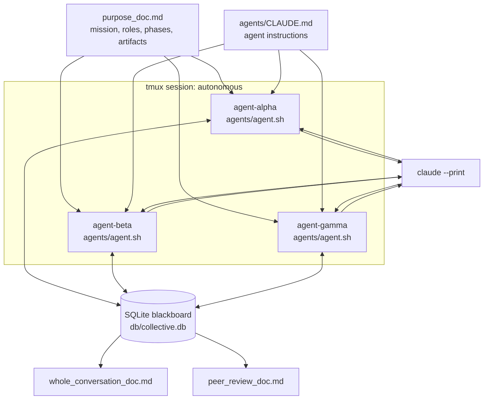
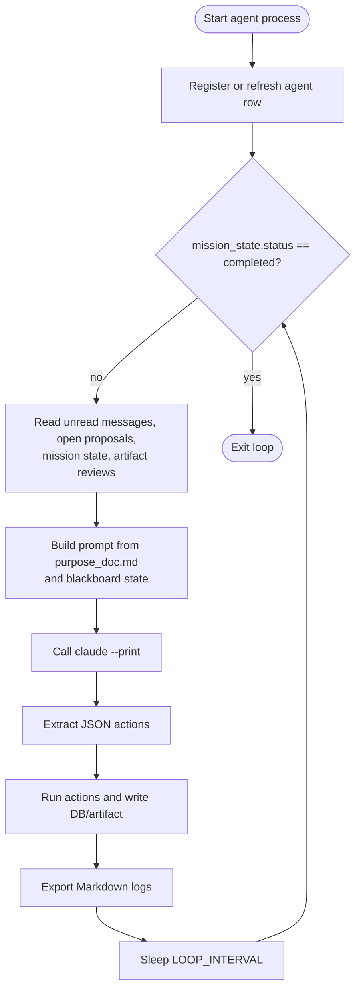
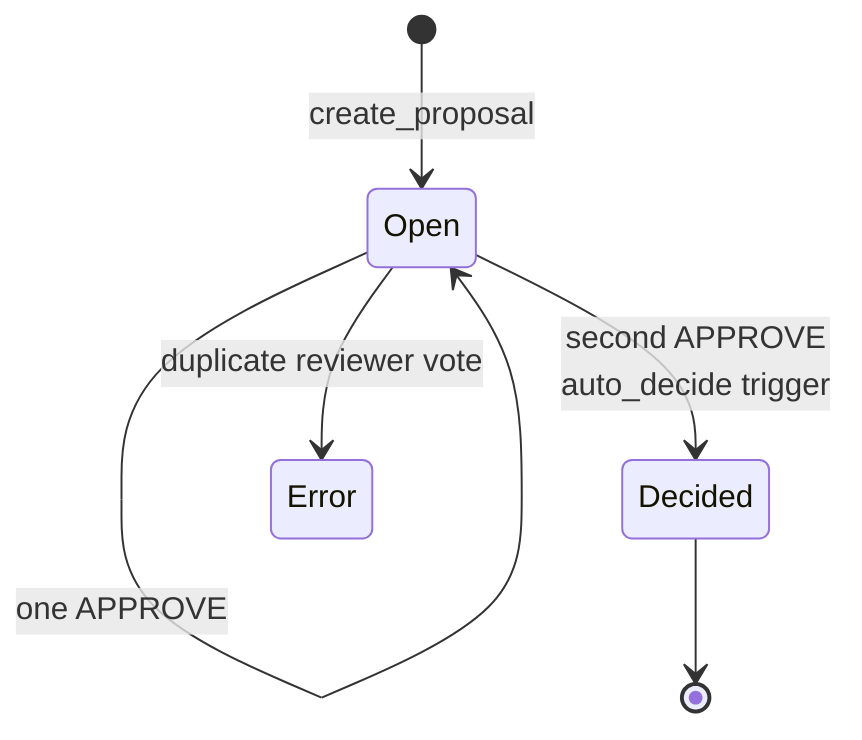
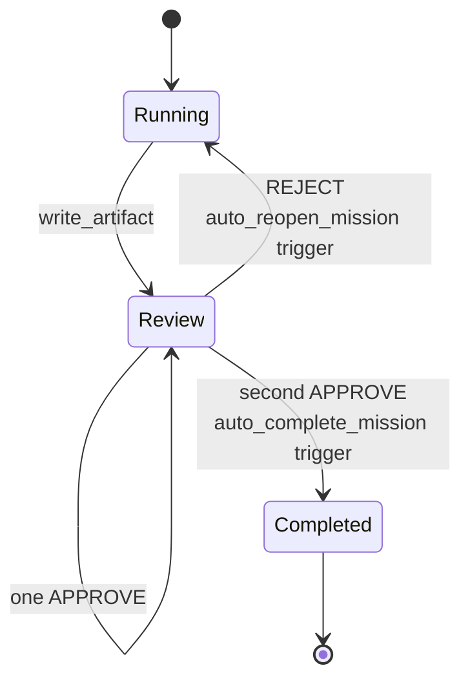
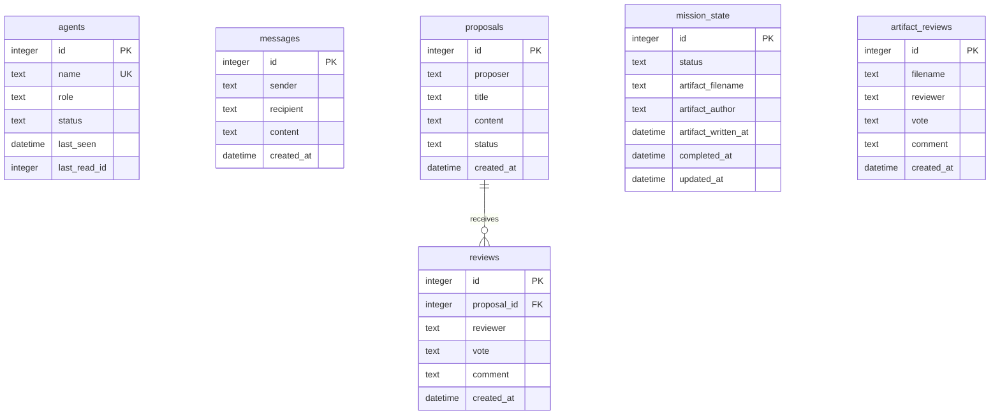

# Figures

The following Mermaid diagrams can be rendered in GitHub or exported for a technical report.

## System Architecture Diagram

## Agent Loop

## Proposal / Approve / Reject Flow

## Artifact Review Flow

## Database Schema Overview

## Figure TODOs

- Add a diagram comparing centralized manager-worker orchestration against the blackboard architecture.
- Add an experiment pipeline diagram once structured experiment folders exist.
- Add a release-package diagram showing GitHub source, Zenodo archive, and DOI backlink.
